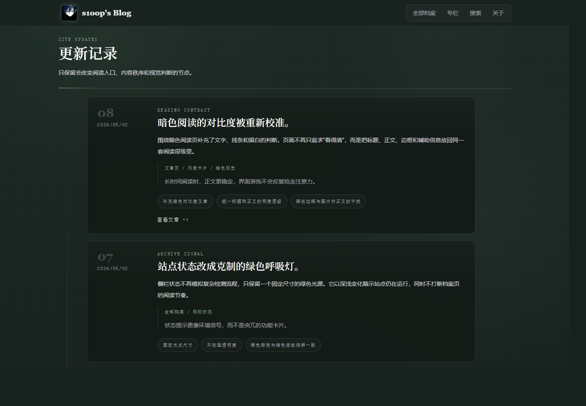

# s1oop Cloudflare Blog Public Copy

[中文](#中文) | [English](#english)

## 中文

这是 `s1oop` 个人博客的脱敏公开副本。它保留了可运行的 Astro + Cloudflare Pages 项目结构、页面组件、公开文章示例和本地开发脚本，但不作为线上站点的真实部署源。

线上站点：<https://s1oop.bbroot.com>

维护者：[s1oopX](https://github.com/s1oopX)

### 项目定位

- 私有主仓库继续作为真实源码和 Cloudflare Pages 部署源。
- 当前仓库用于公开展示、学习、代码阅读和非敏感协作。
- 本仓库不包含本地密钥、Cloudflare 账号状态、生产环境变量、日志、构建产物或私有草稿。

### 截图

#### 文章列表


#### 阅读页面


#### 更新记录



### 功能

- Astro 静态站点生成。
- Markdown 内容通过 Astro Content Collections 管理。
- 暗色档案风格的视觉系统。
- 全部档案、专栏、搜索索引、更新记录和文章详情页。
- Cloudflare Pages 部署结构。
- `functions/api/[[path]].js` 将 `/api/*` 请求委托给 `workers/api.js`。
- 可选的 `/s1oop/admin` 私有 Markdown 发布流程，需要自行配置 GitHub 写入凭据。

### 技术栈

- Astro 6
- TailwindCSS
- Cloudflare Pages
- Cloudflare Pages Functions
- Cloudflare KV，可选
- Wrangler，用于 Worker 配置验证和部署工具链

### 本地开发

```sh
npm install
npm run dev
```

打开：

```text
http://127.0.0.1:4322
```

`npm run dev` 会同时启动：

- Astro dev server：`127.0.0.1:4322`
- 本地 API server：`127.0.0.1:8787`

Astro 会把 `/api/*` 代理到本地 API server，因此本地统计、评论状态和后台检查会接近线上 Pages Functions 的行为。

也可以拆开运行：

```sh
npm run dev:astro
npm run dev:api
npm run dev:proxy
```

### 环境变量

复制示例文件：

```sh
cp .dev.vars.example .dev.vars
```

`.dev.vars` 已被 Git 忽略，不应提交。

私有入口密码：

```text
ADMIN_PASSWORD=...
```

如果要启用 `/s1oop/admin` 发布 Markdown 到你自己的 GitHub 仓库，需要配置：

```text
GITHUB_TOKEN=...
GITHUB_OWNER=...
GITHUB_REPO=...
GITHUB_BRANCH=main
CONTENT_DIR=content/posts
```

可选：

```text
COMMENTS_ENABLED=false
SITE_URL=https://example.com
```

### 构建

```sh
npm run build
npm run preview
```

静态输出目录为 `dist/`。

### Cloudflare Pages

线上站点从私有主仓库部署，不从这个公开副本部署。

推荐 Pages 设置：

```text
Build command: npm run build
Build output directory: dist
Production branch: main
Node.js version: 22
```

Pages Functions 入口：

```text
functions/api/[[path]].js
```

它会复用：

```text
workers/api.js
```

`wrangler.jsonc` 保留了独立 Worker 配置，方便后续验证或扩展。

### 内容写作

文章位于 `content/posts/`：

```md
---
title: My Post
date: 2026-04-29
excerpt: Short summary.
tags:
  - Blog
draft: false
---

Post body.
```

图片可以放在 `public/images/posts/`，并在 Markdown 中使用公开路径引用。

### 安全边界

- 不提交 `.dev.vars`、`.env`、token、密码、私钥或 Cloudflare/GitHub 凭据。
- 公开评论默认关闭。
- 访问统计在没有 `BLOG_KV` 绑定时会返回零值，不会持久化。
- 后台发布 API 只应在可信部署中启用。

### 许可

代码使用 MIT License。

文章内容和图片版权归各自作者所有，除非单独说明。

## English

This is the sanitized public copy of the `s1oop` personal blog. It keeps the runnable Astro + Cloudflare Pages project structure, page components, public sample posts, and local development scripts, but it is not the production deployment source.

Live site: <https://s1oop.bbroot.com>

Maintainer: [s1oopX](https://github.com/s1oopX)

### Repository Role

- The private source repository remains the source of truth for the live Cloudflare Pages deployment.
- This repository is for public review, learning, code reading, and non-sensitive collaboration.
- This copy does not include local secrets, Cloudflare account state, production environment variables, logs, build output, or private drafts.

### Screenshots

#### Blog Archive


#### Article Reading


#### Changelog


### Features

- Astro static site generation.
- Markdown posts through Astro Content Collections.
- Dark archive-style visual system.
- Archive pages, collections, search index, changelog, and article pages.
- Cloudflare Pages deployment structure.
- `/api/*` Pages Functions routed through `functions/api/[[path]].js` and delegated to `workers/api.js`.
- Optional private `/s1oop/admin` Markdown publishing flow when GitHub write credentials are configured.

### Tech Stack

- Astro 6
- TailwindCSS
- Cloudflare Pages
- Cloudflare Pages Functions
- Cloudflare KV, optional
- Wrangler for Worker config validation and deployment tooling

### Local Development

```sh
npm install
npm run dev
```

Open:

```text
http://127.0.0.1:4322
```

`npm run dev` starts:

- Astro dev server on `127.0.0.1:4322`
- Local API server on `127.0.0.1:8787`

Astro proxies `/api/*` to the local API server, so stats, comments state, and admin checks behave close to the deployed Pages Functions.

Split commands are also available:

```sh
npm run dev:astro
npm run dev:api
npm run dev:proxy
```

### Environment Variables

Copy the example file:

```sh
cp .dev.vars.example .dev.vars
```

`.dev.vars` is ignored by Git.

Required for private admin login:

```text
ADMIN_PASSWORD=...
```

Required only if `/s1oop/admin` should publish Markdown files back to your own GitHub repository:

```text
GITHUB_TOKEN=...
GITHUB_OWNER=...
GITHUB_REPO=...
GITHUB_BRANCH=main
CONTENT_DIR=content/posts
```

Optional:

```text
COMMENTS_ENABLED=false
SITE_URL=https://example.com
```

### Build

```sh
npm run build
npm run preview
```

The static output is written to `dist/`.

### Cloudflare Pages

The live site is deployed from the private source repository, not from this public copy.

Recommended Pages settings:

```text
Build command: npm run build
Build output directory: dist
Production branch: main
Node.js version: 22
```

Pages Functions entry:

```text
functions/api/[[path]].js
```

It delegates to:

```text
workers/api.js
```

`wrangler.jsonc` keeps the standalone Worker config for validation and future extension.

### Content

Posts live under `content/posts/`:

```md
---
title: My Post
date: 2026-04-29
excerpt: Short summary.
tags:
  - Blog
draft: false
---

Post body.
```

Images can be placed under `public/images/posts/` and referenced from Markdown with public paths.

### Security Boundary

- Do not commit `.dev.vars`, `.env`, tokens, passwords, private keys, or Cloudflare/GitHub credentials.
- Public comments are disabled by default.
- Visit stats return zero values without a `BLOG_KV` binding and are not persisted.
- The admin publishing API should only be enabled in trusted deployments.

### License

Code is released under the MIT License.

Article content and images remain copyright of their respective author unless a post or asset states otherwise.
