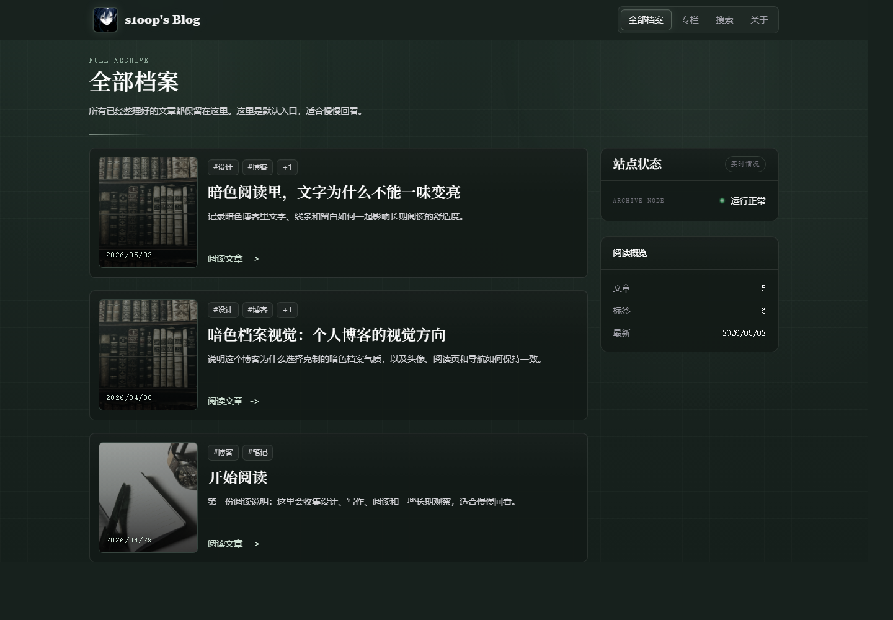
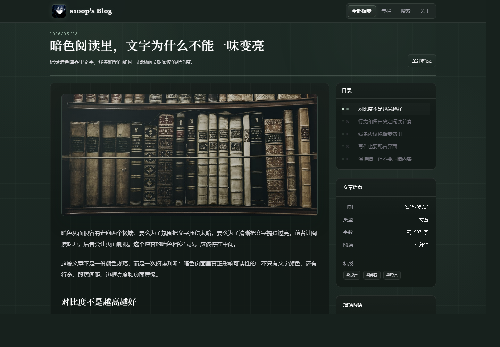

# s1oop Cloudflare Blog

[English Documentation](docs/README.en.md) · [Private Entry Pattern](docs/private-entry.md) · [Live Site](https://s1oop.bbroot.com) · [Changelog](https://s1oop.bbroot.com/changelog)


`s1oop Cloudflare Blog` 是一个面向长期阅读和个人归档的暗色博客项目。它使用 Astro 构建静态页面，通过 Cloudflare Pages 部署，并用 Pages Functions / Worker 复用同一套 API 逻辑。

> 当前仓库是脱敏后的公开源码副本。真实线上站点仍由私有主仓库部署，本仓库不包含生产密钥、Cloudflare 账号状态、本地日志、构建产物或私有草稿。

## 预览

### 文章列表



### 阅读页面



## 特性

- 静态优先：Astro 生成主要页面，适合低维护成本的个人博客。
- 内容清晰：文章通过 Astro Content Collections 管理，结构稳定。
- 阅读导向：暗色档案视觉、克制的动效、独立文章页和侧边信息区。
- 完整入口：包含首页、全部档案、专栏、搜索、更新记录和文章详情页。
- Cloudflare 友好：Pages Functions 接管 `/api/*`，并复用 `workers/api.js`。
- 私有入口边界：公开版只说明维护入口的架构模式，不复用站点所有者的私人路由、界面或发布链路。
- 安全边界：默认不提交 `.dev.vars`、token、密码、日志、构建产物或部署状态。

## 技术栈

| 层级 | 选型 |
| --- | --- |
| Framework | Astro 6 |
| Styling | TailwindCSS |
| Hosting | Cloudflare Pages |
| Runtime API | Cloudflare Pages Functions / Workers |
| Optional Storage | Cloudflare KV |
| Tooling | Wrangler, Node.js 22 |

## 项目结构

```text
content/posts/              Markdown 文章内容
functions/api/[[path]].js   Cloudflare Pages Functions 入口
public/images/              公开图片资源
scripts/                    本地开发与 API 代理脚本
src/components/             页面组件
src/pages/                  Astro 路由页面
workers/api.js              公开 API 示例逻辑
wrangler.jsonc              Worker 配置示例
docs/private-entry.md       私有入口模式说明
```

## 快速开始

```sh
npm install
npm run dev
```

打开：

```text
http://127.0.0.1:4322
```

`npm run dev` 会同时启动 Astro dev server 和本地 API server，并把 `/api/*` 代理到本地 API。

也可以拆分运行：

```sh
npm run dev:astro
npm run dev:api
npm run dev:proxy
```

## 环境变量

复制示例文件：

```sh
cp .dev.vars.example .dev.vars
```

`.dev.vars` 已被 Git 忽略。

常用变量：

```text
COMMENTS_ENABLED=false
SITE_URL=https://example.com
```

私有入口、发布 API 和 GitHub 写入 token 不包含在公开副本中。需要这类能力时，请参考 [Private Entry Pattern](docs/private-entry.md)，并在自己的私有分支或私有仓库实现。

## 私有入口

这个博客可以配一个独立的私有维护入口，用来处理文章发布、内容检查、评论管理或运行状态确认。公开副本不会复用站点所有者的私人路径、后台界面和 GitHub 写入接口，但会保留这类能力的设计边界：

- 私有入口应该独立于公开阅读页面，普通读者不需要知道它的存在。
- 鉴权、会话、发布和写入操作应该放在服务端或边缘函数中处理。
- 密码、GitHub 写入 token、Cloudflare token 等配置只能来自部署环境变量。
- 真实后台 UI 和生产发布链路建议放在私有仓库、私有分支或部署侧配置中。

更完整的双语说明见 [docs/private-entry.md](docs/private-entry.md)。

## 构建

```sh
npm run build
npm run preview
```

静态输出目录为 `dist/`。

## Cloudflare Pages

线上站点从私有主仓库部署，不从这个公开副本部署。

推荐配置：

```text
Build command: npm run build
Build output directory: dist
Production branch: main
Node.js version: 22
```

API 路由：

```text
functions/api/[[path]].js -> workers/api.js
```

## 内容写作

文章位于 `content/posts/`，基础格式如下：

```md
---
title: My Post
date: 2026-04-29
excerpt: Short summary.
tags:
  - Blog
draft: false
---

Post body.
```

图片可以放在 `public/images/posts/`，并在 Markdown 中使用公开路径引用。

## 公开副本边界

本仓库适合阅读源码、学习结构、复用样式和提交非敏感改进。以下内容不会放入公开副本：

- `.dev.vars`、`.env`、token、密码、私钥
- Cloudflare API Token、GitHub 写入 Token
- Cloudflare 项目内部状态或账号配置
- 站点所有者的真实私人入口路由、后台 UI 或发布 API
- 本地日志、`.wrangler/`、`dist/`、`node_modules/`
- 未公开草稿或私有文章

## 维护者

[s1oopX](https://github.com/s1oopX)

初始公开副本由 [Codex](https://github.com/codex) 协助整理。

## License

Code is released under the [MIT License](LICENSE).

Article content and images remain copyright of their respective author unless a post or asset states otherwise.
